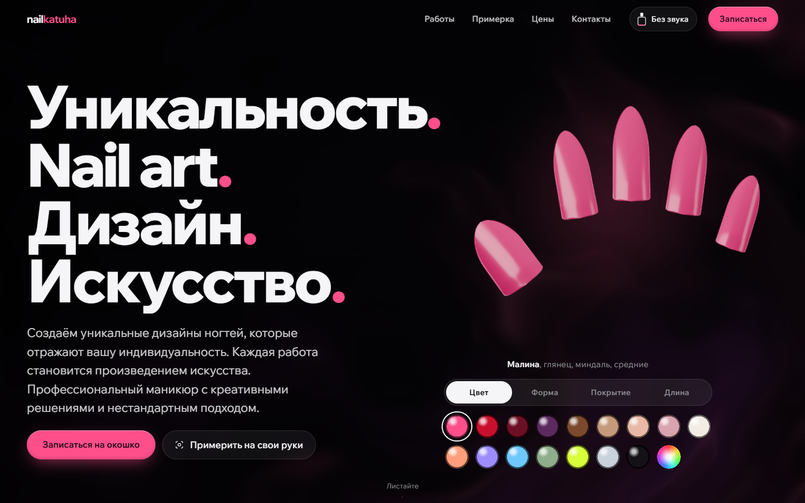

# nailkatuha

Сайт студии маникюра и nail art в Санкт-Петербурге: цены, работы мастера с фильтрами
по длине и стилю, запись на свободное окошко, 3D-типсы, которые можно перекрасить
прямо в первом экране. Фронтенд на Next.js 16, сервер записи на Go.

**Демо:** https://youngover.github.io/nailkatuha/




## Что внутри

| | |
|---|---|
| Живой фон | Под всей страницей медленно течёт залитый лак: шейдер WebGL2 с искажённым шумом, нормали и блик от одного мягкого источника. Цвет берётся из выбранного лака. Работает в отдельном потоке на трети разрешения, 30 кадров в секунду, поэтому не мешает прокрутке |
| Типсы в герое | Настоящие 3D-ногти: сетка с поперечным изгибом как у живого ногтя, физический лаковый материал с прозрачным топом, студийный свет из светящихся панелей без HDR-файлов. Можно выбрать цвет, форму (миндаль, квадрат, балерина, стилет) и покрытие. «Кошачий глаз»: полоса блёсток ходит за курсором, как магнитный гель за магнитом |
| Из чего сделан маникюр | Сцена закреплена на экране, а прокрутка разбирает один ноготь на слои: пластина, база, цвет, топ. Каждый слой прилетает на своё место, текст шага меняется вместе с ним (общая таблица порогов, проверяется тестом) |
| Примерка на руках | Камера, фото руки или пример: MediaPipe находит 21 точку на каждой руке прямо в браузере, ногти закрашиваются выбранным лаком, покрытием и формой. Красятся только руки, повёрнутые тыльной стороной. Модель и wasm лежат на этом же сайте, видео и фото никуда не отправляются. Результат можно сохранить в PNG |
| Курсор-пилочка | Нарисована системным курсором (SVG), поэтому не отстаёт от мыши ни на кадр. Красится в выбранный лак; над кнопками сыплется пыль и звучит пилка. Только на устройствах с мышью |
| Лак на весь сайт | 8 оттенков из мудбордов мастера красят типсы, фон, курсор и акценты. Смена расходится каплей от точки клика через View Transitions API, выбор переживает перезагрузку без мигания |
| Звук | Пилка, крышка флакона и UV-лампа синтезируются Web Audio на лету, без файлов. По умолчанию выключен |
| Работы | Одна галерея с фильтрами по длине и стилю. Маска карточки повторяет длину ногтей на фото. Просмотр в нативном `<dialog>` с переходом из миниатюры и увеличением до 5 раз: колесо, щипок, двойной клик или тап, перетаскивание, клавиши + − 0 |
| Пять причин | Колода карточек: при прокрутке каждая следующая наезжает на предыдущую, та уходит вглубь. На каждой карточке работа мастера, которая подтверждает причину |
| Раскрытие при прокрутке | Секции проявляются по мере прокрутки через CSS scroll-driven animations (`animation-timeline: view()`), без JavaScript и без нагрузки на поток |
| Цены | Меню с точечными выносками; строка ведёт к записи на эту услугу. Цены и адрес в HTML и в разметке `schema.org/BeautySalon` |

## Быстрее и доступнее исходного сайта

Один и тот же мобильный профиль (390×844, процессор в 4 раза медленнее, сеть 4G),
медиана 5 загрузок, `npm run compare`:

| | nailkatuha | nailtitu.ru |
|---|---|---|
| Крупнейший элемент на экране (LCP) | 0,6 с | 2,8 с |
| Полная загрузка | 1,2 с | 16,8 с |
| Вес страницы | 0,7 МБ | 18,6 МБ |
| JavaScript | 498 КБ | 1 170 КБ |
| Блокировка основного потока (TBT) | 143 мс | 943 мс |
| Сдвиги вёрстки (CLS) | 0 | 0 |
| Нарушения axe-core | 0 | 5–6 видов, в том числе кнопка меню без имени и запрет масштабирования |

Сборка в замере отдаётся локально, исходный сайт идёт через интернет, поэтому время
загрузки сравнивается с поправкой; вес, объём JavaScript и блокировка потока от сети
не зависят.

За счёт чего:

- 3D-сцены и фон рисуются в Web Worker, three.js не попадает в основной поток;
- распознавание руки (около 8 МБ) грузится только по нажатию в примерке;
- секции ниже первого экрана размечаются только при подходе (`content-visibility`), картинки в них не грузятся заранее;
- анимация заголовка на CSS, без библиотек: слова поднимаются с первого кадра, без мигания после гидратации;
- карта Яндекса подгружается, когда до контактов остаётся 600 px.

Доступность:

- первая клавиша Tab ведёт «К содержимому»;
- у каждого элемента видимый фокус;
- переключатели лака, формы и покрытия работают как радиогруппы со стрелками;
- контраст текста на каждом из 8 лаков не ниже 4,5:1 (проверяется тестом);
- при `prefers-reduced-motion` остаются только плавные появления, без сдвигов, масштабов и покачивания типс; фон течёт в 5 раз медленнее.

## Адаптивность

Каждая сборка снимается на 7 размерах: 360×780, 390×844, 844×390 (телефон боком),
768×1024, 1024×768, 1440×900, 2560×1440, в Chrome, Firefox и движке Safari (WebKit).
Скрипт падает, если появилась горизонтальная прокрутка или ошибка в консоли.
На телефоне палитра стоит сразу под типсами, кнопка записи остаётся в первом экране,
фильтры работ прокручиваются в одну строку, а в примерке картинка идёт сразу после
вступления, чтобы результат был виден без прокрутки.

Отдельный сценарий проверяет взаимодействия:

- шаги «Из чего сделан маникюр» на разных точках прокрутки;
- просмотр фото: клик по фото не закрывает его, увеличение клавишей, колесом и двойным кликом, стрелки, возврат фокуса;
- фильтры и пустое сочетание;
- примерка на примере (рука найдена, ногти закрашены) и с тестовой камерой Chrome;
- мобильное меню, которое закрывается после выбора раздела и приводит точно к нему;
- сохранение лака после перезагрузки;
- курсор-пилочку в цвете лака и её отсутствие на тач-экранах;
- ссылку «К содержимому»;
- запуск 3D на странице, если браузер не умеет OffscreenCanvas.

```sh
cd web
npm ci
npm test            # логика: цены, маски, палитра и контраст текста на каждом лаке
npm run build       # статическая сборка в out/ (перед ней копируются wasm MediaPipe и скачивается модель руки)
npm run shots       # скриншоты 7 размеров в docs/shots (ENGINE=firefox или ENGINE=webkit для других движков)
npm run e2e         # сценарии взаимодействия в Chrome
npm run a11y        # axe-core, ноутбук и телефон
npm run compare     # загрузка этой сборки и nailtitu.ru на одном мобильном профиле
node scripts/perf.mjs  # кадры, длинные задачи, пересчёты раскладки на реальной видеокарте
```

## Сервер

`server/` на Go 1.25. Сейчас отдаёт каталог услуг; в работе запись с живыми окнами,
удержанием окна на 5 минут и защитой от двойной записи на уровне PostgreSQL.

```sh
cd server
go test ./...
go run ./cmd/nailkatuha -addr :8080   # GET /api/services, GET /healthz
```

## Раскладка

```
web/src/app        главная; старый адрес /portfolio/ ведёт к галерее
web/src/sections   секции главной
web/src/components кнопки, просмотр фото, фильтры, карта
web/src/fx         3D (типсы, слои, общий воркер), фон-лак, примерка, курсор, лак, звук
web/src/styles     стили по секциям и токены
web/src/content    тексты, цены, фото с тегами, формы ногтей
server/            сервер записи на Go
```
